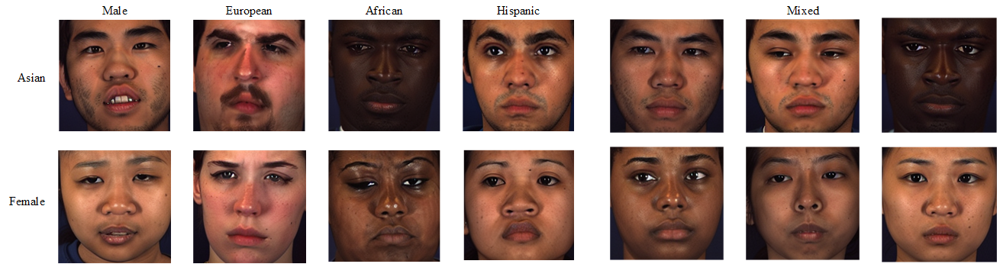

# Dreambooth Stable Diffusion

The rapid improvement in the fitting ability of models in recent years has seen the shortcomings of various data in expression recognition begin to emerge. This paper proposes a new method to generate accurate and new expressions with different facial features of people. It can be used to significantly improve the accuracy of  recognition models. And the feasibility of such a model for the task is analysed using a variety of methods.


This project uses Dreambooth Stable Diffusion training to generate faces with AU information.

- This experiment uses BP4D as the training data. While using ethnicity, age, gender and AU as prompts to train stable diffusion. enables the model to generate custom Action Units of faces.
- Deployment of deepspeed enables this project can be trained on single 1080ti


Different AU of mixed person:


Generated person:


generated person of same AU:



## Method

I try following method to build descriptive prompt

- [ ] ~~deepdanbooru~~
- [ ] ~~autolabel~~
- [x] manual label

I try following method to encode AU as prompt

- [ ] ~~One hot encoding of AU label~~
- [ ] ~~embedding of general AU classification~~
- [x] AU natural language label encoded by CLIP


## Usage

Pretrained checkpoint can be download from [ckpt](https://huggingface.co/runwayml/stable-diffusion-v1-5/blob/main/v1-5-pruned.ckpt)

Dataset preprocessing

```
python tools/handle_images.py ./datasets ./another_datasets --width=512 --height=512
# Notes: change the path to your own datasets
python au2label.py
```

Training and testing

```
# requirement
pip install -r requirement.txt

# accelerate init
accelerate config #stage2 of deepspeed 

# train of style
sh train_style.sh

# change the path in file
python test_model.py

```

## Reference

Thanks to

- [accelerate](https://github.com/huggingface/accelerate)
- [deepspeed](https://github.com/microsoft/DeepSpeed)
- [reambooth-for-diffusion](https://github.com/CrazyBoyM/dreambooth-for-diffusion)
